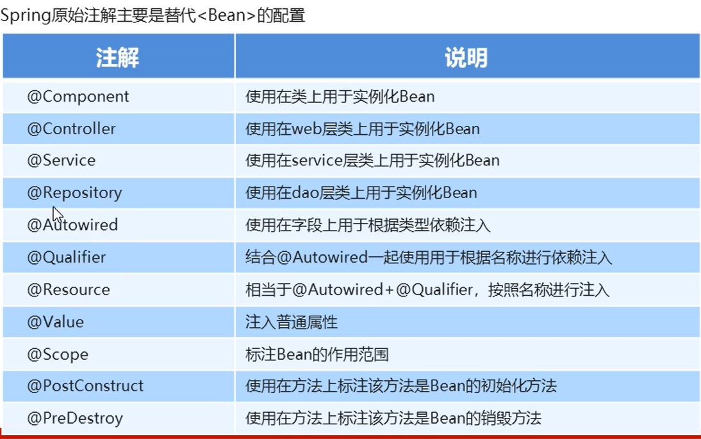
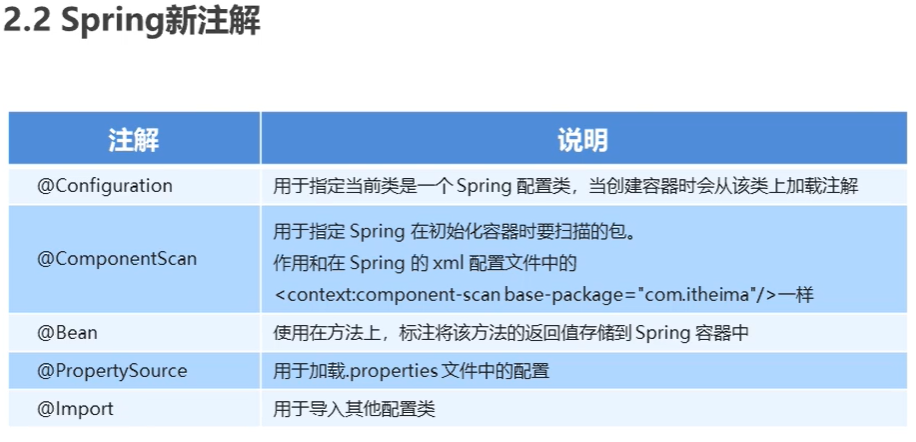

### 第一部分
轻量级 开源<br/>

spring广义：<br/>
Spring Framework、Spring MVC、SpringBoot、Spring Cloud、Spring Data、Spring Security 等，其中 Spring Framework 是其他子项目的基础<br/>
狭义：<br/>
Spring Framework（核心：IOC-把创建对象过程交给Spring进行管理、AOP-用来封装多个类的公共行为，将那些与业务无关，却为业务模块所共同调用的逻辑封装起来，减少系统的重复代码，降低模块间的耦合度。另外，AOP 还解决一些系统层面上的问题，比如日志、事务、权限等。）<br/>

spring Framework架构（模块）：<br/>
数据访问集成模块：<br/>
spring-oxm（对象/XML映射） spring-orm（对象关系映射） spring-jdbc spring-jms（Java消息服务） spring-r2dbc spring-tx<br/>
web模块：<br/>
spring-web（web集成开发） spring-websocket（web双向通讯） spring-webmvc spring-webflux<br/>
（中间模块）：<br/>
spring-aop spring-aspects spring-instrument spring-messaging（spring4.0新增的消息模块）<br/>
核心容器模块：<br/>
spring-beans（包括控制反转、依赖注入） spring-core（封装底层，包括资源访问、类型转换等工具类） spring-context（建立在beans和core模块之上，集成beans和core的功能并扩展一些功能，ApplicationContext接口是上下文模块的焦点） spring-expression（SpEL表达式语言） spring-context-indexer spring-context-support spring-jcl<br/>
Test模块：<br/>
spring-test<br/>

IOC：是一种设计思想，把创建对象过程交给Spring进行管理，与new创建的Java对象没有区别<br/>
为什么叫“控制反转”：在职责层面发生了控制权的反转，把原本调用者通过代码实现的对象的创建，反转给 IoC 容器来帮忙实现<br/>

DI:依赖注入本质上是Spring Bean属性注入的一种，只不过这个属性是一个对象属性而已<br/>

IOC容器的两种实现：BeanFactory（spring最简单的IOC容器（beans模块），懒加载（lazy-load）机制，只有程序使用这个对象才会创建这个对象）  ApplicationContext（是BeanFactory接口的子接口）<br/>
比如：<br/>
``` java
BeanFactory context = new ClassPathXmlApplicationContext("Beans.xml");
ApplicationContext context = new ClassPathXmlApplicationContext("Beans.xml");
```
>（注意：BeanFactory 是 Spring 内部使用接口，通常情况下不提供给开发人员使用。 ）<br/>
>ApplicationContext 接口有四个常用的实现类ClassPathXmlApplicationContext、FileSystemXmlApplicationContext、WebXmlApplicationContext（web应用程序的范围内）、AnnotationConfigApplicationContext（注解配置上下文）

---
### 第二部分 注入 五种方式注入：set/constructor、cp命名空间、内部bean、自动装配、注解
1. Bean属性注入方式：property的set注入/p命名空间 construct构造器注入/c命名空间
``` xml
<!-- set方法注入bean的属性 -->
<bean id="messageBean" class="com.dao.MessageDao">
	<property name="message" value="信息量很大呀"></property>
</bean>
<bean name="messageBean2" class="com.dao.MessageDao" p:message="信息量很大呀">
</bean>
<!-- 构造器注入bean的属性 -->
<bean id="personBean" class="com.dao.PersonDao">
	<constructor-arg name="name" value="diqiuqiu"></constructor-arg>
	<constructor-arg name="messageDao" ref="messageBean"></constructor-arg>
</bean>
<bean name="personBean2" class="com.dao.PersonDao" c:name="diqiuqiu" c:messageDao-ref="messageBean2">
</bean>
<!-- 懒加载初始化、bean初始化执行方法、销毁执行方法 -->
<bean id="studentBean" class="com.dao.StudentDao" p:name="diqiuqiu" lazy-init="true" init-method="init" destroy-method="destroy">
</bean>
```

>bean的作用域（scope）： singleton（单例）、prototype（多例/原型）、request、session、global session（后三种只有WebXmlApplicationContext环境才生效）

>lazy-init（懒加载初始化）:只有要使用这个bean的时候，IOC容器才会去初始化bean实例

>Bean的生命周期可以表达为：Bean的定义——Bean的初始化——Bean的使用——Bean的销毁<br/>
init-method="init" destroy-method="destroy" （值为bean实例对象中定义的init、destroy方法，在初始化实例对象或者销毁实例对象时被调用）

**继承父bean**
``` xml
<bean id="sonMessageBean" class="com.dao.SonMessageDao" parent="messageBean">
    <property name="messNum" value="99"></property>
    <property name="messPerson" value="yiqiu"></property>
</bean>
```

2. 注入内部Bean的写法：
``` xml
<bean id="buyCarBean" class="com.dao.BuyCatDao">
    <property name="carDao">
        <bean class="com.dao.CarDao"></bean>
    </property>
</bean>
```

3. 注入集合：List、Set、Map、Properties（Props）
``` xml
<bean id="addressBean" class="com.dao.AddressDao">
    <property name="addressList">
        <list>
            <value>江苏</value>
            <value>湖北</value>
            <value>湖南</value>
        </list>
    </property>
    <property name="addressSet">
        <set>
            <value>江苏</value>
            <value>湖北</value>
            <value>湖南</value>
        </set>
    </property>
    <property name="addressMap">
        <map>
            <entry key="address1" value="江苏"></entry>
            <entry key="address2" value="湖北"></entry>
            <entry key="address3" value="湖南"></entry>
        </map>
    </property>
    <property name="addressProps">
        <props>
            <prop key="address1">江苏</prop>
            <prop key="address2">湖北</prop>
            <prop key="address3">湖南</prop>
        </props>
    </property>
</bean>
```

4. 自动装配Bean：byName通过寻找属性同名的id的bean、byType通过寻找属性同类型的class的bean、constructor通过寻找属性同名的id的bean
``` xml
<bean id="personalInfoBean" class="com.dao.PersonalInfoDao" autowire="byName">
    <property name="userName" value="diqiuqiu"></property>
</bean>
<bean id="personalInfoBean2" class="com.dao.PersonalInfoDao" autowire="byType">
    <property name="userName" value="diqiuqiu"></property>
</bean>
<bean id="idCardDao" class="com.dao.IDCardDao">
    <property name="idNo" value="42068888888888888"></property>
    <property name="idType" value="B01"></property>
</bean>

<bean id="personBean3" class="com.dao.PersonDao" autowire="constructor">
	<constructor-arg name="name" value="diqiuqiu"></constructor-arg>
</bean>
<bean id="messageDao" class="com.dao.MessageDao">
	<property name="message" value="信息量很大啊！"></property>
	<property name="messNum" value="999"></property>
</bean>
```

5. 注解注入方式：
>开启注解<context:annotation-config></context:annotation-config>

>@Autowired根据类型查找 @Qualifier("shoesInfoBean")存在同类型的根据id查找<br/>
根据id查找再根据类型查找@Resource(name = "shoesInfoBean")——JSR-250<br/>

>塞入值@Value("19.9")

>和init-method相同作用的注解@PostConstruct 和destroy-method相同作用的注解@PreDestroy——JSR-250

>@Configuration 和 @Bean 注解声明bean定义，只能用于AnnotationConfigApplicationContext环境中

---
### 第三部分 AOP
AOP作用：
>用来封装多个类的公共行为，将那些与业务无关，却为业务模块所共同调用的逻辑封装起来，减少系统的重复代码，降低模块间的耦合度。
另外，AOP 还解决一些系统层面上的问题，比如日志、事务、权限等。

AOP底层实现原理：
>通过JDK/CGLIB动态代理技术生成代理对象，代理对象方法执行时进行增强功能的接入，最后只要调用目标对象方法，从而完成功能的增强。

JDK动态代理和CGLIB动态代理区别和相同点：
>JDK动态代理的代理目标类必须要实现接口<br/>
CGLIB动态代理的增强器必须要继承目标类为父类<br/>
相同点：都是在运行时产生代理对象<br/>

``` java
//JDK动态代理实现：
public class Target implements TargetInterface {//动态代理目标类
    @Override
    public void save() {
        System.out.println("执行save方法.....");
    }
}

public class Advice {//切面类
    public void before() {
        System.out.println("before方法执行。。。");
    }
    public void after() {
        System.out.println("after方法执行。。。");
    }
}

public class Common {
    private Target target;
    private Advice advice;
    public Object createProxy() {//生成代理对象
        TargetInterface pro = (TargetInterface) Proxy.newProxyInstance(target.getClass().getClassLoader(),
            target.getClass().getInterfaces(),
            new InvocationHandler() {
                @Override
                public Object invoke(Object proxy, Method method, Object[] args) throws Throwable {
                advice.before();
                Object invoke = method.invoke(target, args);
                advice.after();
                return invoke;
                }
            });
        return pro;
    }
    public void setTarget(Target target) {
        this.target = target;
    }
    public void setAdvice(Advice advice) {
        this.advice = advice;
    }
}

public class ProxyTest {//测试
    public static void main(String[] args) {
        ClassPathXmlApplicationContext applicationContext = new ClassPathXmlApplicationContext("beans.xml");
        Common common = applicationContext.getBean("common",Common.class);
        TargetInterface proxy = (TargetInterface) common.createProxy();
        proxy.save();
    }
}
```
``` xml
<bean id="common" class="com.proxy.Common">
    <property name="target">
        <bean class="com.proxy.Target"></bean>
    </property>
    <property name="advice">
        <bean class="com.proxy.Advice"></bean>
    </property>
</bean>
```
``` java
//CGLIB动态代理实现：
public class Target {//动态代理目标类
    public void save() {
        System.out.println("执行save2方法.....");
    }
}

public class Advice {//切面类
    public void before() {
        System.out.println("before2方法执行。。。");
    }
    public void after() {
        System.out.println("after2方法执行。。。");
    }
}

public class Common {
    private Target target2;
    private Advice advice2;
    public Object createProxy() {//生成代理对象
        //创建增强器
        Enhancer enhancer = new Enhancer();
        //设置父类目标
        enhancer.setSuperclass(Target.class);
        //设置回调
        enhancer.setCallback(new MethodInterceptor() {
            @Override
            public Object intercept(Object o, Method method, Object[] objects, MethodProxy methodProxy) throws Throwable {
                advice2.before();
                Object invoke = method.invoke(target2, objects);
                advice2.after();
                return invoke;
            }
        });
        Target proxy = (Target) enhancer.create();
        return proxy;
    }
    public void setTarget2(Target target2) {
        this.target2 = target2;
    }
    public void setAdvice2(Advice advice2) {
        this.advice2 = advice2;
    }
}

public class ProxyTest {//测试
    public static void main(String[] args) {
        ClassPathXmlApplicationContext applicationContext = new ClassPathXmlApplicationContext("beans.xml");
        Common common = applicationContext.getBean("common2",Common.class);
        Target proxy = (Target) common.createProxy();
        proxy.save();
    }
}
```
``` xml
<bean id="common2" class="com.proxy2.Common">
    <property name="target2">
        <bean class="com.proxy2.Target"></bean>
    </property>
    <property name="advice2">
        <bean class="com.proxy2.Advice"></bean>
    </property>
</bean>
```

>AOP的名词概念：<br/>
target（目标对象）：被代理的目标对象<br/>
proxy（代理）：被AOP织入后产生的代理对象<br/>
joinPoint（连接点）：AOP中被拦截的方法（大范围）<br/>
pointCut（切入点）：在连接点的基础上，对连接点进行拦截的定义（小范围）<br/>
advice（通知）：拦截连接点之后做的操作<br/>
aspect（切面）：切入点+通知<br/>
weaving（织入）：将切入点+通知结合产生代理对象的过程<br/>

方式一：XML配置AOP<br/>
``` java
public class Logging {//切面类

    public void before() {
        System.out.println("前置通知。。。。");
    }

    public void after() {
        System.out.println("后置通知。。。。");
    }

    public void afterReturn(Object rt) {
        System.out.println("后置返回通知。。。。"+rt);
    }

    public void afterThrow(Exception exception) {
        System.out.println("后置异常通知。。。。");
    }

    public void around(ProceedingJoinPoint pj) throws Throwable {
        System.out.println("环绕通知1111。。。。");
        Object proceed = pj.proceed();
        System.out.println(proceed.toString()+"环绕里面的");
        System.out.println("环绕通知2222。。。。");
    }
}

public class StudyDao {//目标类

    @Value("diqiuqiu")
    private String name;
    @Value("学习")
    private String active;
    @Value("SpringFramework")
    private String thing;

    public String doThing() {
        System.out.println("学习类："+this.getName()+this.getActive()+this.getThing());
        return "学习类："+this.getName()+this.getActive()+this.getThing();
    }

    public String getName() {
        return name;
    }

    public String getActive() {
        return active;
    }

    public String getThing() {
        return thing;
    }

    @Override
    public String toString() {
        return "StudyDao{" +
                "name='" + name + '\'' +
                ", active='" + active + '\'' +
                ", thing='" + thing + '\'' +
                '}';
    }
}

public class SpringFrameworkTest {//测试类

    public static void main(String[] args) {
        ApplicationContext context = new ClassPathXmlApplicationContext("beans.xml");
        //spring AOP
        StudyDao studyBean = context.getBean("studyBean", StudyDao.class);
        studyBean.doThing();
    }
}
```
``` xml
<!-- AOP面向切面编程 -->
<bean id="studyBean" class="com.dao.StudyDao"></bean>
<bean id="loggingBean" class="com.dao.Logging"></bean>
<aop:config>
    <aop:aspect ref="loggingBean">
        <aop:pointcut id="pointCutId" expression="execution(public String com.dao.*.*(..))"/>
        <aop:before method="before" pointcut-ref="pointCutId"></aop:before>
        <aop:after method="after" pointcut-ref="pointCutId"></aop:after>
        <aop:after-returning method="afterReturn" pointcut-ref="pointCutId" returning="rt"></aop:after-returning>
        <aop:after-throwing method="afterThrow" pointcut-ref="pointCutId" throwing="exception"></aop:after-throwing>
        <aop:around method="around" pointcut-ref="pointCutId"></aop:around>
    </aop:aspect>
</aop:config>
```

方式二：注解配置AOP<br/>
``` xml
<!-- 开启组件自动扫描 -->
<context:component-scan base-package="com.dao"></context:component-scan>
<!-- 自动代理 -->
<aop:aspectj-autoproxy/>
```
``` java
@Component("loggingBean")
@Aspect
public class Logging {

    @Before("pointCut()")
    public void before() {
        System.out.println("前置通知。。。。");
    }

    @After("pointCut()")
    public void after() {
        System.out.println("后置通知。。。。");
    }

    @AfterReturning("pointCut()")
    public void afterReturn(Object rt) {
        System.out.println("后置返回通知。。。。"+rt);
    }

    @AfterThrowing("pointCut()")
    public void afterThrow(Exception exception) {
        System.out.println("后置异常通知。。。。");
    }

    @Around("pointCut()")
    public void around(ProceedingJoinPoint pj) throws Throwable {
        System.out.println("环绕通知1111。。。。");
        //获取连接点信息
        Signature signature = pj.getSignature();
        //调用连接点的方法
        Object proceed = pj.proceed();
        System.out.println(proceed.toString()+"环绕里面的");
        System.out.println("环绕通知2222。。。。"+signature);
    }

    //声明一个切点方法
    @Pointcut("execution(public String com.dao.StudyDao.doThing(..))")
    public void pointCut() {}
}
```
---
### 注解篇
>spring原注解
> @Component、@Controller、@Service、@Repository、@Autowired、@Qualifier、@Resource、@Value、@Scope、@PostConstruct、@PreDestory



>spring新注解
> @configuration、ComponentScan、@Bean、@PropertySource、@Import


---
### 数据源（连接池）
> 常见的数据源（连接池）：DBCP、C3P0、BoneCP、Druid等
